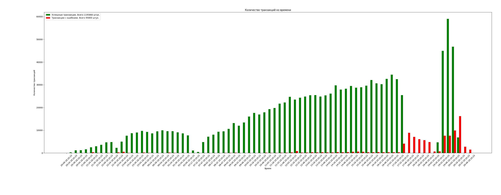

# Аналитика aptos graffio

В данном репозитории описано количество юзеров, которые приняли участие в graffio.

- **240 000** блоков.
- **613 445** уникальных адресов.
- **587 049** адресов, которые сделали только успешные транзакции.
- **1 196 358** успешных транзакций.
- **95 821** транзакций с ошибкой.

В репозитории есть файл `database.json`, в нем хранятся только уникальные кошельки и количество транзакций на них.
Локально у нас есть еще одна база данных, она в 3 раза больше размером и имеет также номер блока и таймстемп.
Если вам она вдруг понадобилась (вдруг вы хотите получить какую-то другую информацию), вы можете написать нам в тг `@svzsup` и вы скинем вам файл с полной бд.

На картинке показано количество кошельков, которые взаимодействовали с контрактом graffio и вызывали именно функцию draw.
Зеленым цветом отмечены все успешные транзакции. Красным отмечены транзакции с ошибками.
Обычно это "Out of gas" или ошибка по причине остановки работы контракта.

Каждый столбик диаграммы отображает количество кошельков за 15 минут.

Также мы добавили чекер активностей связанных с данным контрактом.
Если вы хотите проверить количество транзакций на ваших кошельках:

1. Запишите адреса кошельков в `wallets.txt`. Один кошелек на одну строку, не оставляя при этом в txt файле пустых строк.
2. Установите библиотеку для работы с excel командой в терминале `pip install openpyxl`.
3. Запустите скрипт командой в терминале `python main.py`.
